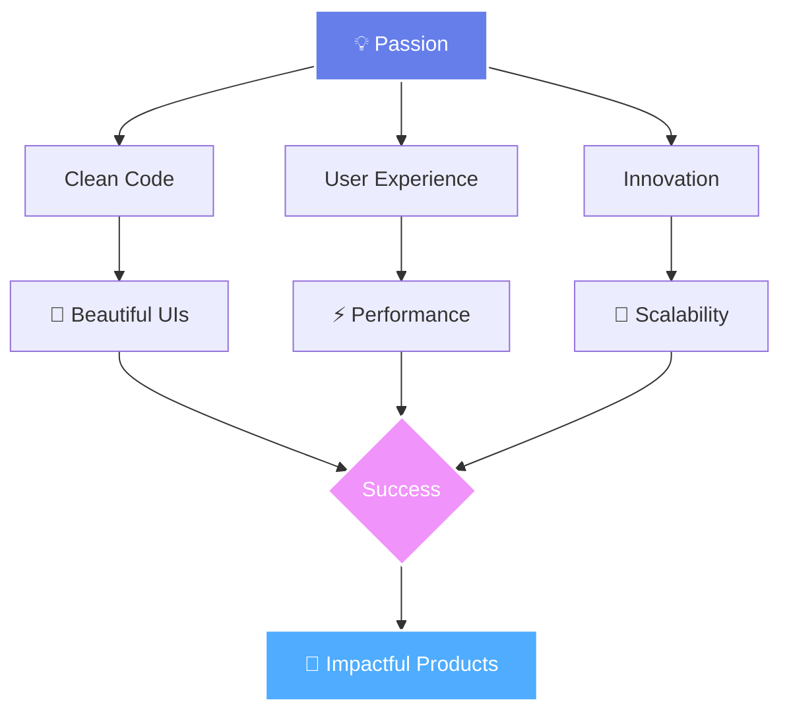
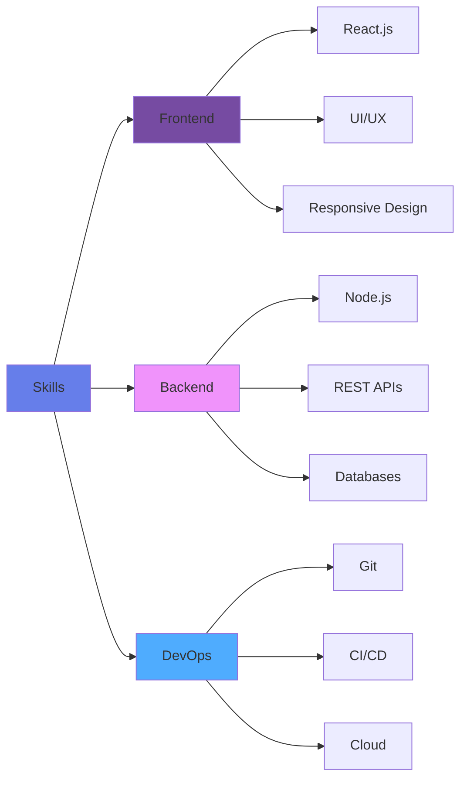

<div align="center">
  
</div>

<div align="center">
  
</div>

<div align="center">
  
[](https://visitcount.itsvg.in)
  
</div>

<div align="center">
  
  ```diff
  @@ Availability Status @@
  + 🟢 Open for Opportunities
  + 💼 Available for Freelance Work
  + 🤝 Open for Collaborations
  ```
  
</div>

---

## 🚀 About Me

<div align="center">
  
</div>

<br>

<table>
<tr>
<td width="55%" valign="top">

### 👨‍💻 Who Am I?

```typescript
class FullStackDeveloper {
  constructor() {
    this.name = "Vasara Sujal";
    this.role = "Full-Stack Developer";
    this.location = "India 🇮🇳";
    this.education = "Computer Science Engineering";
  }

  get skills() {
    return {
      languages: ["JavaScript", "TypeScript", "C++", "SQL"],
      frontend: ["React.js", "Redux", "TailwindCSS", "Sass"],
      backend: ["Node.js", "Express.js", "REST APIs"],
      database: ["MongoDB", "MySQL", "Mongoose"],
      tools: ["Git", "Postman", "VS Code", "Figma"],
      currently_learning: ["Next.js", "Docker", "AWS", "GraphQL"]
    };
  }

  get currentFocus() {
    return [
      "🍔 Building King Hub - Food Delivery Platform",
      "🌐 Contributing to Open Source Projects",
      "📚 Mastering System Design & Architecture",
      "💡 Exploring Web3 & Blockchain Technology"
    ];
  }

  displayPassion() {
    return "Transforming ideas into elegant, scalable solutions! 🚀";
  }
}

const vasara = new FullStackDeveloper();
console.log(vasara.displayPassion());
// Output: "Transforming ideas into elegant, scalable solutions! 🚀"
```

</td>
<td width="45%" valign="top">

### 🎯 What Drives Me

<br>



<br>

### 🌟 Core Values

<table>
<tr>
<td align="center" width="33%">
💎<br><b>Quality</b><br>
<sub>Writing clean, maintainable code</sub>
</td>
<td align="center" width="33%">
🚀<br><b>Innovation</b><br>
<sub>Exploring cutting-edge tech</sub>
</td>
<td align="center" width="33%">
🤝<br><b>Collaboration</b><br>
<sub>Growing with the community</sub>
</td>
</tr>
</table>

### 📍 Current Mission

> Building **King Hub** - A next-generation food delivery platform that revolutionizes the way people order food online!

**Tech Stack:** `React` `Node.js` `MongoDB` `Express` `TailwindCSS`

</td>
</tr>
</table>

### 💫 Quick Facts About Me

<div align="center">

| 🎯 **Current Status** | 📚 **Learning** | 🤝 **Open To** | 💬 **Ask Me About** |
|:---:|:---:|:---:|:---:|
| Building King Hub | Advanced React Patterns | Collaborations | MERN Stack |
| Open Source Contributor | System Design | Freelance Work | RESTful APIs |
| Available for Hire | Cloud Architecture | Mentorship | UI/UX Design |

</div>

<br>

<div align="center">

### 🎨 My Development Philosophy

**"First, solve the problem. Then, write the code. Finally, make it beautiful."**

[](https://git.io/typing-svg)

</div>

---

## 🌐 Connect With Me

<div align="center">
  
[](https://www.linkedin.com/in/sujal-vasara/)
[](https://x.com/SujalVasara)
[](mailto:vasarasujal.cg@gmail.com)
[](#)
[](https://github.com/VasaraSujal)

</div>

---

## 🏆 Featured Projects

<div align="center">

### 🍔 King Hub - Food Delivery Platform
*A comprehensive, modern food delivery solution built with the MERN stack*

[](https://github.com/VasaraSujal)
[](https://github.com/VasaraSujal)
[](https://github.com/VasaraSujal)

</div>

<details open>
<summary><b>📋 Project Details</b></summary>
<br>

<table>
<tr>
<td width="50%">

#### ✨ Key Features
- 🎨 **Modern UI/UX** - Sleek, responsive design with smooth animations
- 🛒 **Smart Cart System** - Real-time updates & persistent storage
- 🔐 **Secure Authentication** - JWT-based user management
- 💳 **Payment Integration** - Multiple payment gateway support
- 📱 **Mobile Responsive** - Seamless experience across all devices
- 🔍 **Advanced Search** - Filter by cuisine, price, ratings
- ⭐ **Review System** - User ratings and feedback mechanism
- 📊 **Admin Dashboard** - Complete order & inventory management

</td>
<td width="50%">

#### 🛠️ Tech Stack
```yaml
Frontend:
  Framework: React.js with Hooks
  Styling: TailwindCSS
  Animation: Framer Motion
  Routing: React Router
  State: Context API

Backend:
  Runtime: Node.js
  Framework: Express.js
  Database: MongoDB + Mongoose
  Auth: JWT
  API: RESTful Design

DevOps:
  Version Control: Git & GitHub
  API Testing: Postman
  Design: Figma
  Hosting: MongoDB Atlas
```

</td>
</tr>
</table>

</details>

---

<div align="center">

### 💼 More Amazing Projects

</div>

<table>
<tr>
<td width="33%" valign="top">

### 🎯 Project Alpha
[](https://github.com/VasaraSujal)

**Tech:** `React` `Node.js` `MongoDB` `TailwindCSS`

A comprehensive web application showcasing advanced full-stack development with modern UI/UX patterns and scalable architecture.

**Features:**
- 🚀 Real-time updates
- 🔐 Secure authentication
- 📊 Data visualization
- 🎨 Modern design

</td>
<td width="33%" valign="top">

### 🚀 Project Beta
[](https://github.com/VasaraSujal)

**Tech:** `TypeScript` `Next.js` `PostgreSQL` `Prisma`

An innovative solution built with cutting-edge technologies, focusing on performance optimization and user experience.

**Features:**
- ⚡ Lightning fast
- 🌐 SEO optimized
- 💾 Database efficiency
- 🎯 Type safety

</td>
<td width="33%" valign="top">

### 🔥 Project Gamma
[](https://github.com/VasaraSujal)

**Tech:** `Vue.js` `Firebase` `Tailwind` `Chart.js`

A data-driven dashboard application with real-time analytics and beautiful data visualizations.

**Features:**
- 📈 Real-time analytics
- 🎨 Custom charts
- 🔄 Live sync
- 📱 Responsive

</td>
</tr>
</table>

---

## 💻 Tech Stack & Tools

<div align="center">

### Core Technologies

<table>
<tr>
<td align="center" width="96">

<br>JavaScript
</td>
<td align="center" width="96">

<br>TypeScript
</td>
<td align="center" width="96">

<br>React
</td>
<td align="center" width="96">

<br>Node.js
</td>
<td align="center" width="96">

<br>Express
</td>
<td align="center" width="96">

<br>MongoDB
</td>
<td align="center" width="96">

<br>MySQL
</td>
</tr>
<tr>
<td align="center" width="96">

<br>HTML5
</td>
<td align="center" width="96">

<br>CSS3
</td>
<td align="center" width="96">

<br>Tailwind
</td>
<td align="center" width="96">

<br>Sass
</td>
<td align="center" width="96">

<br>Bootstrap
</td>
<td align="center" width="96">

<br>Redux
</td>
<td align="center" width="96">

<br>Vite
</td>
</tr>
<tr>
<td align="center" width="96">

<br>Git
</td>
<td align="center" width="96">

<br>GitHub
</td>
<td align="center" width="96">

<br>VS Code
</td>
<td align="center" width="96">

<br>Postman
</td>
<td align="center" width="96">

<br>Figma
</td>
<td align="center" width="96">

<br>Linux
</td>
<td align="center" width="96">

<br>Vercel
</td>
</tr>
</table>

### 📚 Currently Learning


</div>

---

## 📊 GitHub Analytics

<div align="center">
  


</div>

<div align="center">
  


</div>

---

## 🎯 Coding Profiles

<div align="center">

| Platform | Profile | Stats |
|----------|---------|-------|
| 💻 **LeetCode** | [@yourusername](https://leetcode.com/yourusername) |  |
| 🏆 **HackerRank** | [@yourusername](https://hackerrank.com/yourusername) |  |
| 👨‍💻 **CodeChef** | [@yourusername](https://codechef.com/users/yourusername) |  |
| 📚 **GeeksforGeeks** | [@yourusername](https://auth.geeksforgeeks.org/user/yourusername) |  |

</div>

---

## 💼 What I Bring to the Table

<div align="center">



</div>

<table>
<tr>
<td width="33%" valign="top">

### 🎓 Education
- 🏫 Computer Science Engineering
- 📚 Continuous Learning (Udemy, Coursera)
- 🧠 DSA & System Design
- 💻 Full-Stack Specialization

</td>
<td width="33%" valign="top">

### 🎯 Goals 2024
- ✅ Build 5+ Full-Stack Projects
- ✅ Master React & Node.js
- 🔄 10 Open Source Contributions
- 🔄 Technical Blog Writing
- 🔄 AWS/Azure Certification

</td>
<td width="33%" valign="top">

### 🤝 Looking For
- 💼 Full-Stack Developer Role
- 🌟 Open Source Collaborations
- 📝 Freelance Opportunities
- 👥 Mentorship & Networking
- 🚀 Innovative Projects

</td>
</tr>
</table>

---

## 📬 Let's Build Something Amazing Together!

<div align="center">

### 💡 Open to Discuss

<table>
<tr>
<td align="center">🌐<br><b>Web Development</b></td>
<td align="center">🎨<br><b>UI/UX Design</b></td>
<td align="center">🔧<br><b>Tech Solutions</b></td>
<td align="center">🚀<br><b>New Ideas</b></td>
<td align="center">🤝<br><b>Collaborations</b></td>
</tr>
</table>

### 📧 Reach Out

[](mailto:vasarasujal.cg@gmail.com)

<br>

**💼 Available for:** `Freelance Work` • `Full-Time Roles` • `Technical Consulting` • `Open Source` • `Mentorship`

</div>

---

## ✨ Beyond the Code

<div align="center">

### 🎭 When I'm Not Coding

<table>
<tr>
<td align="center" width="20%">
  <br>
  <b>Gaming</b><br>
  Strategy & RPG
</td>
<td align="center" width="20%">
  <br>
  <b>Reading</b><br>
  Tech & Sci-Fi
</td>
<td align="center" width="20%">
  <br>
  <b>Music</b><br>
  All Genres
</td>
<td align="center" width="20%">
  <br>
  <b>Coffee</b><br>
  Espresso Lover
</td>
<td align="center" width="20%">
  <br>
  <b>Fitness</b><br>
  Daily Routine
</td>
</tr>
</table>

### 💭 Developer Quote

> *"First, solve the problem. Then, write the code."*  
> **— John Johnson**

</div>

---

<div align="center">

### 🙏 Thank You for Visiting!

**Found something interesting? Drop a ⭐ on my repositories!**

<br>


<br>

**⭐ From [VasaraSujal](https://github.com/VasaraSujal) with 💜**


</div>
